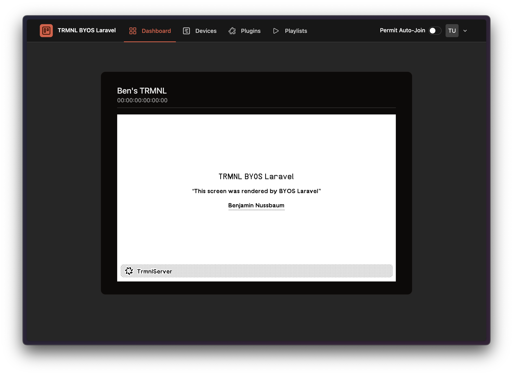
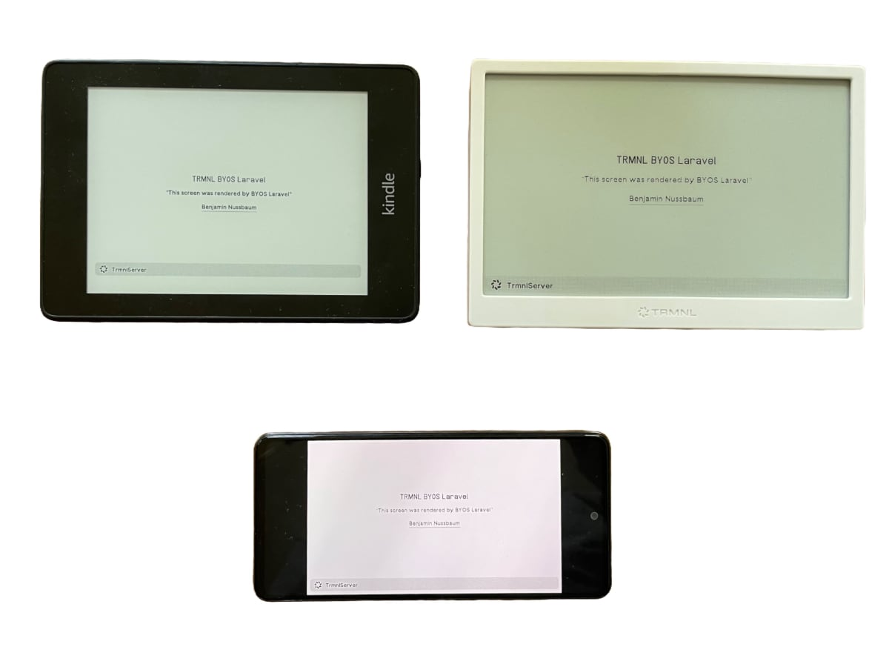

## TRMNL BYOS (PHP/Laravel)

[](https://github.com/usetrmnl/byos_laravel/actions/workflows/test.yml)

TRMNL BYOS Laravel is a self-hostable implementation of a TRMNL server, built with Laravel.
It enables you to manage TRMNL devices, generate screens dynamically, and can act as a proxy for the native cloud service (native plugins, recipes).

If you are looking for a Laravel package designed to streamline the development of both public and private TRMNL plugins, check out [bnussbau/trmnl-laravel](https://github.com/bnussbau/laravel-trmnl).




* 👉 [more Screenshots](screenshots/SCREENSHOTS.md)

### Key Features

* 📡 Device Information – Display battery status, WiFi strength, firmware version, and more.
* 🔍 Auto-Join – Automatically detects and adds devices from your local network.
* 🖥️ Screen Generation – Supports Plugins (even Mashups), Recipes, API, Markup, or updates via Code.
  * Supported Devices / Apps: TRMNL, ESP32 with TRMNL firmware, [trmnl-android](https://github.com/usetrmnl/trmnl-android), [trmnl-kindle](https://github.com/usetrmnl/byos_laravel/pull/27), …
* 🔄 TRMNL API Proxy – Can act as a proxy for the native cloud service (requires TRMNL Developer Edition).
    * This enables a hybrid setup – for example, you can update your custom Train Monitor every 5 minutes in the morning, while displaying native TRMNL plugins throughout the day.
* 🌙 Dark Mode – Switch between light and dark mode.
* 🐳 Deployment – Dockerized setup for easier hosting (Dockerfile, docker-compose).
* 🛠️ Devcontainer support for easier development.



### 🎯 Target Audience

This project is for developers who are looking for a self-hosted server for devices running the TRMNL firmware.
It serves as a starter kit, giving you the flexibility to build and extend it however you like.

### Support ❤️
This repo is maintained voluntarily by [@bnussbau](https://github.com/bnussbau).

Support the development of this package by purchasing a TRMNL device through the referral link: https://usetrmnl.com/?ref=laravel-trmnl. At checkout, use the code `laravel-trmnl` to receive a $15 discount on your purchase.

or

[](https://www.buymeacoffee.com/bnussbau)

### Hosting

Run everywhere, where Docker is supported: Raspberry Pi, VPS, NAS, Container Cloud Service (Cloud Run, ...).
For production use, generate a new APP_KEY (`php artisan key:generate --show`) and set the environment variable `APP_KEY=`. For personal use, you can disable registration (see section Environment Variables).

#### Docker Compose
Docker Compose file located at: [docker/prod/docker-compose.yml](docker/prod/docker-compose.yml).

##### Backup Database
```sh
docker ps #find container id of byos_laravel container
docker cp {{CONTAINER_ID}}:/var/www/html/database/storage/database.sqlite database_backup.sqlite
```

##### Updating via Docker Compose
```sh
docker compose pull
docker compose down
docker compose up -d
```

#### VPS
If you’re using a VPS (e.g., Hetzner) and prefer an alternative to native Docker, you can install Dokploy and deploy BYOS Laravel using the integrated [Template](https://templates.dokploy.com/?q=trmnl+byos+laravel).
It’s a quick way to get started without having to manually manage Docker setup.

### PikaPods
You can vote for TRMNL BYOS Laravel to be included as PikaPods Template here: [feedback.pikapods.com](https://feedback.pikapods.com/posts/842/add-app-trmnl-byos-laravel)

#### Other Hosting Options
Laravel Forge, or bare metal PHP server with Nginx or Apache is also supported.

#### Requirements

* PHP >= 8.2
* ext-imagick
* puppeteer [see Browsershot docs](https://spatie.be/docs/browsershot/v4/requirements)

### Local Development

see [docs/DEVELOPMENT.md](docs/DEVELOPMENT.md)


### Demo Plugins

Run the ExampleRecipesSeeder to seed the database with example plugins:

```bash
php artisan db:seed --class=ExampleRecipesSeeder
```

* Zen Quotes
* This Day in History
* Weather
* Train Departure Monitor
* Home Assistant
* Sunrise/Sunset

### Usage

#### Environment Variables

| Environment Variable          | Description                                                                                                                                 | Default           |
|-------------------------------|---------------------------------------------------------------------------------------------------------------------------------------------|-------------------|
| `TRMNL_PROXY_BASE_URL`        | Base URL of the native TRMNL service                                                                                                        | https://trmnl.app |
| `TRMNL_PROXY_REFRESH_MINUTES` | How often should the server fetch new images from native service                                                                            | 15                |
| `REGISTRATION_ENABLED`        | Allow user registration via Webinterface                                                                                                    | 1                 |
| `SSL_MODE`                    | SSL Mode, if not using a Reverse Proxy ([docs](https://serversideup.net/open-source/docker-php/docs/customizing-the-image/configuring-ssl)) | `off`             |
| `FORCE_HTTPS`                 | If your server handles SSL termination, enforce HTTPS.                                                                                      | 0                 |
| `PHP_OPCACHE_ENABLE`          | Enable PHP Opcache                                                                                                                          | 0                 |
| `TRMNL_IMAGE_URL_TIMEOUT`     | How long TRMNL waits for a response on the display endpoint. (sec)                                                                          | 30                |

#### Login

If your environment is local, you can access the server at `http://localhost:4567` and login with user / password
`admin@example.com` / `admin@example.com`, otherwise register. With environment variable `REGISTRATION_ENABLED` you can control, if registration is allowed.

### ➕ Add Your TRMNL Device

##### Auto-Join (Local Network)

1. Switch on the “Permit Auto-Join” toggle in the header. For that to work only one user can be registered.
2. New devices on your local network will be detected and added automatically when connecting to the server.

✅ This is the easiest way to connect your devices with minimal effort.

##### Manually

1.	Open the Devices page:
      👉 http://localhost:4567/devices
2.	Click “Add New Device”.
3.	Retrieve your TRMNL MAC Address and API Key:
- You can grab the TRMNL Mac Address and API Key from the TRMNL Dashboard
- Alternatively, debug incoming requests to /api/setup to determine them


### ⚙️ Configure Server for Device

#### 📌 Firmware Version 1.4.6 or Newer

* Setup device
* After entering Wifi credentials, choose "Custom Server"
* Point to the URL of your server

#### Firmware Older Than 1.4.6

If your device firmware is older than 1.4.6, you need to flash a new firmware version to point it to your server.

See this YouTube guide: [https://www.youtube.com/watch?v=3xehPW-PCOM](https://www.youtube.com/watch?v=3xehPW-PCOM)

### ☁️ Activate fresh TRMNL Device with Cloud Proxy

1) Setup the TRMNL as in the official docs with the cloud service (connect one of the plugins to later verify it works)
2) Setup Laravel BYOS, create a user and login
3) In Laravel BYOS in the header bar, activate the toggle "Permit Auto-Join"
4) Press and hold the button on the back of your TRMNL for 5 seconds to reactivate the captive portal (or reflash).
5) Go through the setup process again, in the screen where you provide the Wi-Fi credentials there is also option to set the Server URL. Use the local address of your Laravel BYOS
6) The device should automatically appear in the device list; you can deactivate the "Permit Auto-Join" toggle again.
7) In the devices list, activate the toggle "☁️ Proxy" for your device. (Make sure that the queue worker is active. In the docker image it should be running automatically.)
8) As long as no Laravel BYOS plugin is scheduled, the device will show your cloud plugins.

###### Troubleshooting

Make sure that your device has a Developer license, you should be able to verify by calling the `https://trmnl.app/api/display` endpoint.

* [https://docs.usetrmnl.com/go/private-api/introduction](https://docs.usetrmnl.com/go/private-api/introduction)
* [https://docs.usetrmnl.com/go/private-api/fetch-screen-content](https://docs.usetrmnl.com/go/private-api/fetch-screen-content)

### 🖥️ Generate Screens

#### Markup via Web Interface

1.	Navigate to Plugins > Markup in the Web Interface.
2.	Enter your markup manually or select from the available templates.
3.	Save and apply the changes.

* Available Blade Components are listed here: [laravel-trmnl-blade | Blade Components](https://github.com/bnussbau/laravel-trmnl-blade/tree/main/resources/views/components)

#### 🎨 Blade View
* Edit `resources/views/trmnl.blade.php`
    * Available Blade Components are listed here: [laravel-trmnl-blade | Blade Components](https://github.com/bnussbau/laravel-trmnl-blade/tree/main/resources/views/components)
* To generate the screen, run

```bash
php artisan trmnl:screen:generate
```

#### Generate via API
You can dynamically update screens by sending a POST request.

* Send a POST request to `/api/screen` with the following payload

##### Header

`Authorization` `Bearer <TOKEN>`

##### Body

```json
{
    "markup": "<h1>Hello World</h1>"
}
```

### 🤝 Contribution
Contributions are welcome! See [CONTRIBUTING.md](CONTRIBUTING.md) for details.

### License
[MIT](LICENSE.md)

