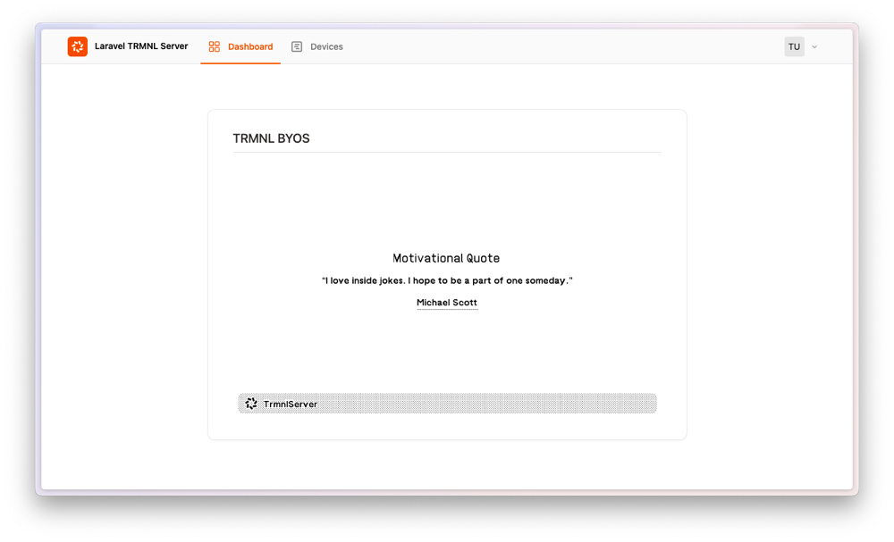

## TRMNL BYOS (PHP/Laravel)

Laravel Trmnl Server is a self-hostable implementation of a TRMNL server, built with Laravel. 
It enables you to manage TRMNL devices, generate screens dynamically, and can act as a proxy for the TRMNL API (native plugin system). 
Inspired by [usetrmnl/byos_sinatra](https://github.com/usetrmnl/byos_sinatra).

If you are looking for a Laravel package designed to streamline the development of both public and private TRMNL plugins, check out [bnussbau/trmnl-laravel](https://github.com/bnussbau/laravel-trmnl).



* 👉 [more Screenshots](screenshots/SCREENSHOTS.md)

### Key Features

* 📡 Device Information – Display battery status, WiFi strength, firmware version, and more. 
* 🔍 Auto-Join – Automatically detects and adds devices from your local network. 
* 🖥️ Screen Generation – Supports Markup, API, or update via Code. 
* 🔄 TRMNL API Proxy – Can act as a proxy for the TRMNL Display API (requires TRMNL Developer Edition). 
  * This enables a hybrid setup – for example, you can update your custom Train Monitor every 5 minutes in the morning, while displaying native TRMNL plugins throughout the day.
* 🐳 Deployment – Dockerized setup for easier hosting (Dockerfile, docker-compose).

### 🎯 Target Audience

This project is for developers who are looking for a self-hosted server for devices running the TRMNL firmware.
It serves as a starter kit, giving you the flexibility to build and extend it however you like.

### Support ❤️
This repo is maintained voluntarily by [@bnussbau](https://github.com/bnussbau).

Support the development of this package by purchasing a TRMNL device through our referral link: https://usetrmnl.com/?ref=laravel-trmnl. At checkout, use the code `laravel-trmnl` to receive a $15 discount on your purchase.

### Requirements

* PHP >= 8.2
* ext-imagick
* puppeteer [see Browsershot docs](https://spatie.be/docs/browsershot/v4/requirements)

### Installation

#### Clone the repository

```bash
git clone git@github.com:bnussbau/laravel-trmnl-server.git
```

#### Copy environment file

```bash
cp .env.example .env
php artisan key:generate
```

#### Install dependencies

```bash
composer install
npm i
```

#### Run migrations

```bash
php artisan migrate --seed
```

#### Run the server

To make your server accessible in the network, you can run the following command:

```bash
php artisan serve  --host=0.0.0.0 --port 4567
```

### Docker
Use the provided Dockerfile, or docker-compose file to run the server in a container.
You can persist the database file by mounting a volume to `/var/www/html/database/database.sqlite`.

```Dockerfile
# docker-compose.yaml
volumes:
    - ./database/database.sqlite:/var/www/html/database/database.sqlite
```

### Usage

#### Environment Variables

| environment                   | description                                                      | default           |
|-------------------------------|------------------------------------------------------------------|-------------------|
| `TRMNL_PROXY_BASE_URL`        | Base URL of the native TRMNL service                             | https://trmnl.app |
| `TRMNL_PROXY_REFRESH_MINUTES` | How often should the server fetch new images from native service | 15                |
| `REGISTRATION_ENABLED`        | Allow user registration via Webinterface                         | 1                 |
| `FORCE_HTTPS`                 | If your server handles SSL termination, enforce HTTPS.           | 0                 |

#### Login

If your environment is local, you can access the server at `http://localhost:4567` and login with user / password
`admin@example.com` / `admin@example.com`, otherwise register. With environment variable `REGISTRATION_ENABLED` you can control, if registration is allowed.

#### ➕ Add Your TRMNL Device

##### Auto-Join (Local Network)

1. Switch on the “Permit Auto-Join” toggle in the header. For that to work only one user can be registered.
2. New devices on your local network will be detected and added automatically when connecting to the server.

✅ This is the easiest way to connect your devices with minimal effort.

##### Manually

1.	Open the Devices page:
👉 http://localhost:4567/devices
2.	Click “Add New Device”.
3.	Retrieve your TRMNL MAC Address and API Key:
   - You can grab the TRMNL Mac Address and API Key from the TRMNL Dashboard
   - Alternatively, debug incoming requests to /api/setup to determine them

### ⚙️ Configure Server for Device

#### 📌 Firmware Version 1.4.6 or Newer

* Setup device
* After entering Wifi credentials, choose "Custom Server"
* Point to the URL of your server

#### Firmware Older Than 1.4.6

If your device firmware is older than 1.4.6, you need to flash a new firmware version to point it to your server.

See this YouTube guide: [https://www.youtube.com/watch?v=3xehPW-PCOM](https://www.youtube.com/watch?v=3xehPW-PCOM)

### 🖥️ Generate Screens

#### 🎨 Blade View
* Edit `resources/views/trmnl.blade.php`
  * Available Blade Components are listed here: [laravel-trmnl | Blade Components](https://github.com/bnussbau/laravel-trmnl/tree/main/resources/views/components)
* To generate the screen, run

```bash
php artisan trmnl:screen:generate
```

#### Generate via API
You can dynamically update screens by sending a POST request.

* Send a POST request to `/api/screen` with the following payload

##### Header

`Authorization` `Bearer <TOKEN>`

##### Body

```json
{
    "markup": "<h1>Hello World</h1>"
}
```

Token can be retrieved under Plugins > API in the Web Interface.

#### Markup via Web Interface

1.	Navigate to Plugins > Markup in the Web Interface.
2.	Enter your markup manually or select from the available templates.
3.	Save and apply the changes.

* Available Blade Components are listed here: [laravel-trmnl | Blade Components](https://github.com/bnussbau/laravel-trmnl/tree/main/resources/views/components)

#### 🛠️ Generate Screens Programmatically

You can fetch external data, process it, and generate screens dynamically.
* Fetch data from an external source.
* Either render it in a Blade view or directly insert markup.
* Use Laravel’s scheduler to automate updates.

#### 📌 Example: Fetch Train Monitor Data

This example retrieves data from [trmnl-train-monitor](https://github.com/bnussbau/trmnl-train-monitor) and updates the screen periodically.

##### Step 1: Create a new Artisan Command

```bash
php artisan make:command PluginTrainMonitorFetch
```

##### Step 2: Edit PluginTrainMonitorFetch.php

```php
class PluginTrainMonitorFetch extends Command
{
    protected $signature = 'plugin:train:fetch';

    protected $description = 'Fetches train monitor data and updates the screen';

    public function handle(): void
    {
        $markup = Http::get('https://oebb.trmnl.yourserver.at/markup')->json('markup');
        GenerateScreenJob::dispatchSync(1, $markup);
    }
}
```

##### Step 3: Schedule the Command in console.php

```php
Schedule::command('plugin:train:fetch')
    ->everyFiveMinutes()
    ->timezone('Europe/Vienna')
    ->between('5:00', '18:00');
```

This will automatically update the screen every 5 minutes between 5:00 AM and 6:00 PM local time.

### 🏗️ Roadmap

Here are some features and improvements that are open for contribution:

##### 🔌 Plugin System

- Enable configurable plugins via the Web Interface.
- Ensure compatibility with the trmnl-laravel package.
- Implement auto-discovery for plugins.

##### ⏳ Scheduling

- Move task scheduling from console.php to a Web Interface.
- Allow users to configure custom schedule intervals.

##### 🖥️ “Native” Plugins
- Add built-in plugins such as (as an example):
    - ☁️ Weather
    - 💬 Quotes
    - 🏡 Home Assistant integration
- Provide Web UI controls to enable/disable plugins.

##### 📦 Visual Studio Code Devcontainer
* Add a .devcontainer to this repo for easier development with Docker.

#####  Improve Code Coverage

- Expand Pest tests to cover more functionality.
- Increase code coverage (currently at 86.9%).

### 🤝 Contribution
Contributions are welcome! If you’d like to improve the project, follow these steps:

1.	Open an Issue
      - Before submitting a pull request, create an issue to discuss your idea.
      - Clearly describe the feature or bug fix you want to work on.
2.	Fork the Repository & Create a Branch 
3.  Make Your Changes & Add Tests
    - Ensure your code follows best practices.
    - Add Pest tests to cover your changes.
4.	Run Tests
    - `php artisan test`
5.  Submit a Pull Request (PR)
    - Push your branch and create a PR.
    - Provide a clear description of your changes.

🚀 Thank you for contributing! Every contribution helps improve the project.

### License
MIT

